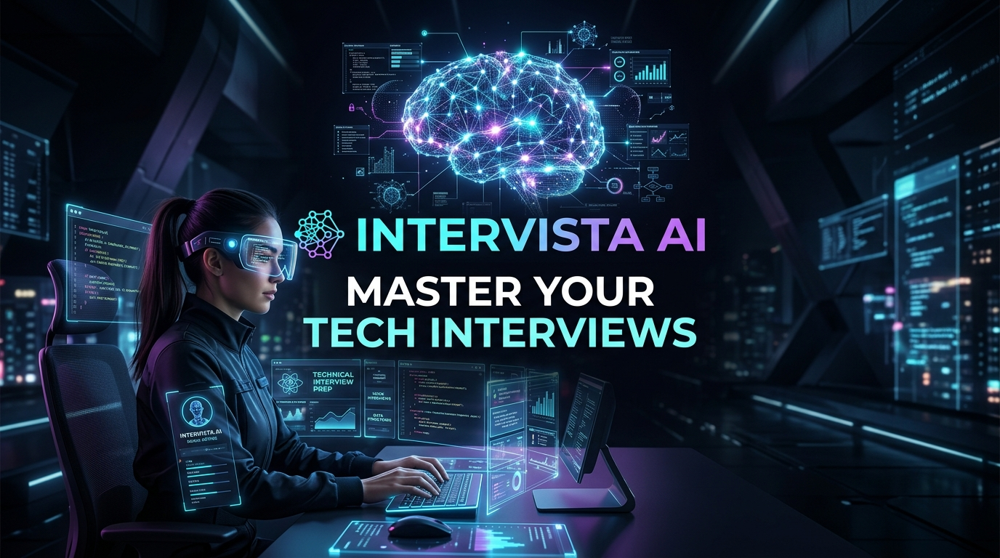
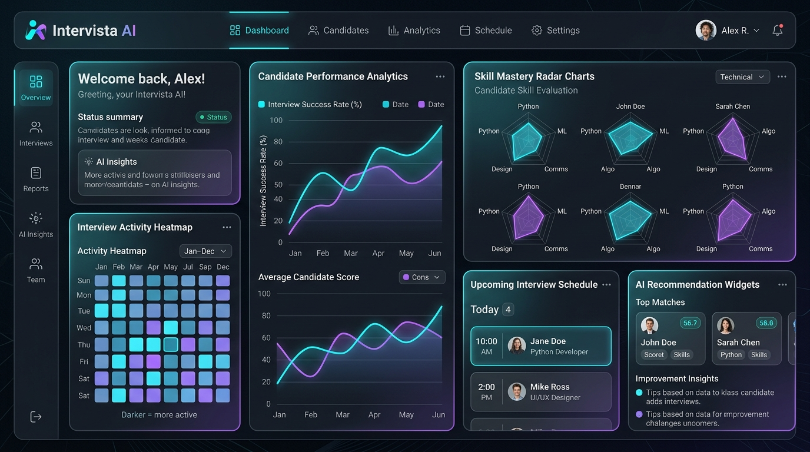
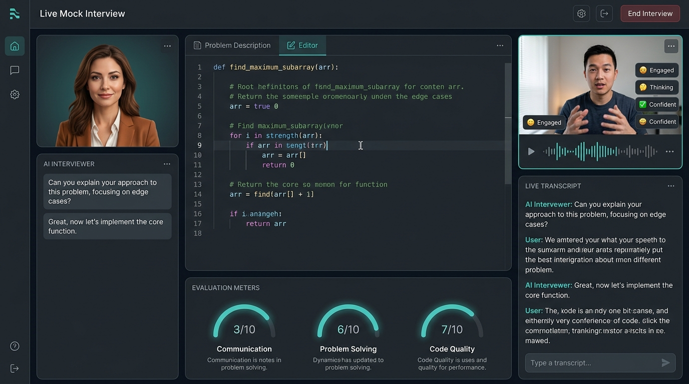
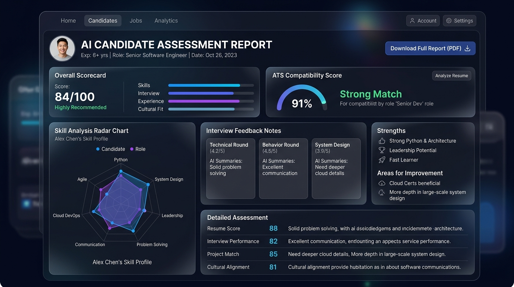
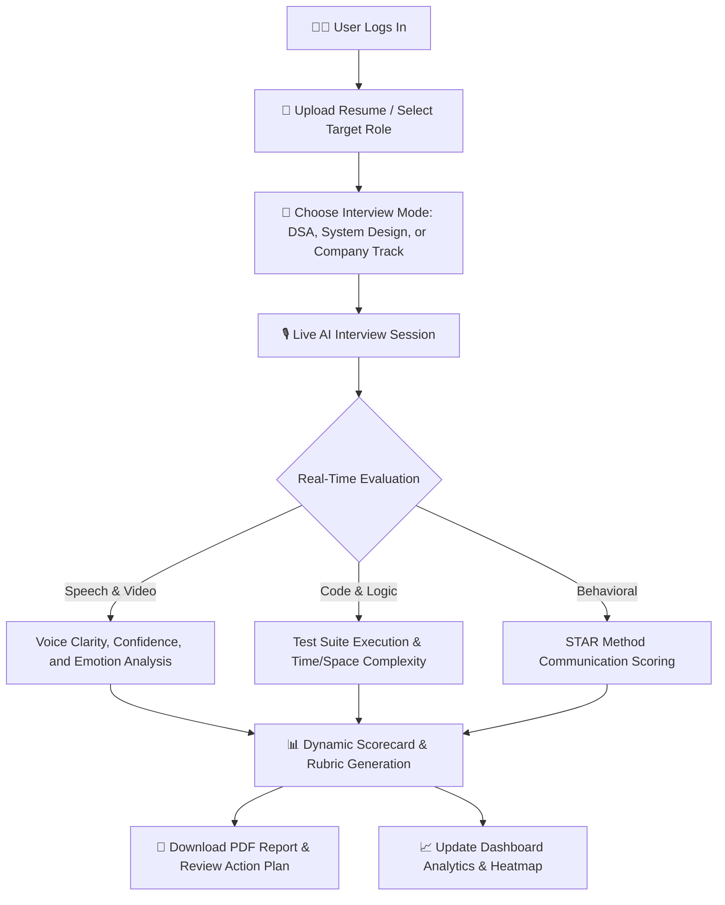
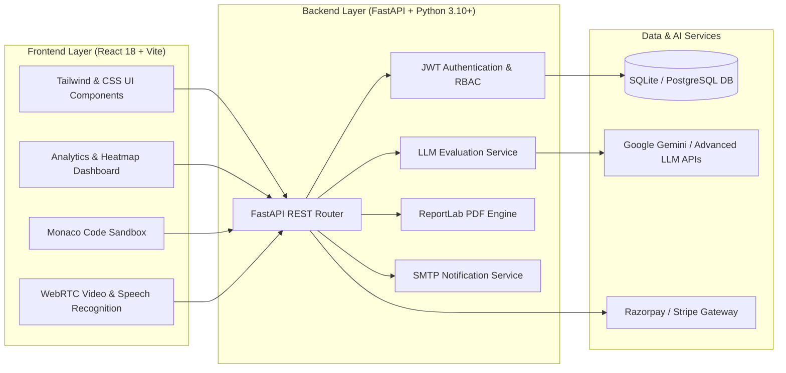

<div align="center">

# 🌟 Intervista AI

### *Next-Generation AI-Powered Technical Interview & Career Assessment Platform*

[](https://reactjs.org/)
[](https://fastapi.tiangolo.com/)
[](https://python.org/)
[](https://vitejs.dev/)
[](LICENSE)

<br />



<br /><br />

[Explore Features](#-key-features) •
[How It Works](#-how-it-works) •
[Platform Showcase](#-visual-showcase) •
[Architecture](#-system-architecture) •
[Installation](#-getting-started) •
[API Reference](#-api-endpoints)

---

</div>

## 📖 Introduction & Overview

**Intervista AI** is a comprehensive, enterprise-grade AI technical interview simulation and career readiness platform. Engineered for software engineers, data scientists, and tech professionals, Intervista AI bridges the gap between self-study and high-stakes technical interviews.

By combining **state-of-the-art Large Language Models (LLMs)**, **real-time speech & video analysis**, and **live interactive coding sandboxes**, the platform provides an authentic interview environment that evaluates candidates on problem solving, algorithmic efficiency, architectural reasoning, and behavioral communication.

```
       Candidate Experience                      AI Intelligence Engine                   Actionable Analytics
 ┌──────────────────────────────┐              ┌────────────────────────┐              ┌────────────────────────┐
 │ • Live Webcam & Speech Stream│ ───────────► │ • Context-Aware LLMs   │ ───────────► │ • Granular Rubric (10) │
 │ • Interactive Code Sandbox   │              │ • Audio / Video Vision │              │ • ATS Resume Insights  │
 │ • Adaptive Question Flow     │              │ • Code AST & Execution │              │ • Downloadable PDF     │
 └──────────────────────────────┘              └────────────────────────┘              └────────────────────────┘
```

---

## ✨ Key Features

### 🎙️ 1. Real-Time AI Mock Interviews
- **Adaptive AI Interviewer:** Dynamically asks follow-up and clarifying questions based on your live responses, code changes, and edge-case handling.
- **Multimodal Video & Speech Feedback:** Analyzes vocal confidence, speech clarity, engagement levels, and pacing during the interview.
- **Dynamic Speech-to-Text & Live Transcripts:** Full continuous speech transcription with instant speech-to-code synchronization.

### 💻 2. In-Browser Coding Sandbox & DSA Challenges
- **Interactive Code Editor:** Multi-language syntax highlighting with real-time linting, formatting, and auto-completion.
- **Automated Test Runner:** Instant execution against standard and hidden test cases with execution time and memory profiling.
- **Algorithmic Evaluation:** Detailed feedback on time complexity ($O(N)$), space complexity, clean code principles, and alternative optimal solutions.

### 📊 3. Predictive Analytics & Performance Heatmaps
- **Interview Activity Heatmap:** Track daily streaks, practice intensity, and interview volume over time.
- **Skill Mastery Radar:** Comprehensive multi-axis breakdown across Data Structures, System Design, Communication, and Problem Solving.
- **Historical Trajectory:** Visual performance curves indicating progress across technical rounds.

### 📄 4. AI Resume Analyzer & ATS Match Scoring
- **Automated Resume Parsing:** Extracts skills, experience, and project domains from uploaded resumes.
- **ATS Compatibility Gauge:** Scores your profile against target job specifications and identifies critical skill gaps.
- **Tailored Improvement Action Plans:** Generates custom interview questions and preparation roadmaps aligned with your resume weaknesses.

### 🏢 5. Company-Specific Preparation Tracks
- **Targeted Question Banks:** Curated question banks and evaluation patterns modeled after FAANG and top tier tech organizations (Google, Amazon, Microsoft, TCS, Meta, and more).
- **Aptitude & Technical Resource Hub:** Comprehensive curated learning materials, DSA topic roadmaps, and cheat sheets.

### 🏆 6. Global Leaderboards & Job Matching
- **Gamified Progress:** Earn badges, level up skill tiers, and compete on community leaderboards.
- **Smart Job Recommendations:** Discover curated open job listings matched with your evaluated interview competencies and verified skills.

### 📑 7. Dynamic PDF Assessment Reports
- **Instant Report Generation:** One-click generation of beautifully formatted, comprehensive PDF assessment reports with rubrics, transcripts, scores, and recommendations.

### 💳 8. Tiered Pricing & Seamless Payments
- **Transparent Plans:** Flexible pricing options designed for individuals and teams (Free Tier ₹0, Pro Tier ₹99, Team Tier ₹199).
- **Integrated Checkout:** Secure, instantaneous payment processing with Razorpay and Stripe support.

---

## 📸 Visual Showcase

<div align="center">

### 🖥️ Dashboard & Skill Analytics
*Monitor interview readiness, skill distribution radar, activity streaks, and upcoming schedules.*



<br />

### 🎥 Live Mock Interview Room
*Conduct realistic video interviews with real-time speech transcription, live code evaluation, and continuous rubric scoring.*



<br />

### 📊 Candidate Assessment Scorecard & ATS Analytics
*Receive granular feedback breakdowns, ATS compatibility metrics, and downloadable PDF performance reports.*



</div>

---

## 🔄 How It Works

Intervista AI follows an intuitive, end-to-end user journey designed to maximize interview readiness:



1. **Profile Setup & Resume Parsing:** Upload your resume to automatically calibrate interview questions to your background and experience tier.
2. **Session Configuration:** Choose between General DSA, System Design, Behavioral rounds, or Company-specific preparation tracks.
3. **Interactive Simulation:** Enter the live interview room. The AI prompts you with questions, listens to your verbal thought process, observes your coding technique, and provides intelligent nudges when needed.
4. **Instant Evaluation:** Upon submission, the AI engine processes the full transcript, code diffs, and behavioral metrics to produce a detailed candidate scorecard.
5. **Actionable Roadmap:** Review targeted suggestions, identify skill blind spots, and export your formal assessment PDF report.

---

## 🏗️ System Architecture

Intervista AI is built with a modern, high-throughput micro-architecture separating client rendering, RESTful API routing, and AI orchestration:



### 🛠️ Technology Stack

| Layer | Technologies |
|---|---|
| **Frontend** | React 18, Vite, Modern Vanilla CSS & TailwindCSS, Recharts, Lucide Icons, jsPDF, Monaco Editor |
| **Backend** | Python 3.10+, FastAPI, SQLAlchemy, Pydantic v2, Uvicorn, ReportLab, Requests |
| **AI & NLP** | Google Gemini 1.5/2.0 Pro/Flash, Web Speech API, Custom Heuristic & AST Evaluators |
| **Database** | SQLite (Dev) / PostgreSQL (Production), SQLAlchemy ORM |
| **Services** | SMTP Email Integration, Razorpay & Stripe Checkout |

---

## 📂 Project Structure

```
Intervista-AI/
├── assets/                          # Showcase visuals and architecture diagrams
│   ├── hero-banner.jpg
│   ├── dashboard-preview.jpg
│   ├── mock-interview-preview.jpg
│   └── analytics-report-preview.jpg
├── frontend/                        # Frontend Client Application
│   ├── public/                      # Static web assets
│   ├── src/
│   │   ├── assets/                  # Icons, images, illustrations
│   │   ├── components/              # Modular UI components
│   │   │   ├── dashboard/           # Analytics, Heatmap, Leaderboard, AIChat, Challenges
│   │   │   ├── Footer/              # App Footer
│   │   │   └── FeedbackModal.jsx    # Instant feedback & Gmail notification modal
│   │   ├── context/                 # Auth & global state management
│   │   ├── pages/                   # Main view pages (Dashboard, Interviews, Companies, Pricing, Resources)
│   │   ├── utils/                   # Code runners, DSA datasets, PDF generators, Evaluators
│   │   ├── App.jsx                  # Root application router
│   │   └── main.jsx                 # Application entry point
│   ├── package.json                 # Frontend dependencies
│   └── vite.config.js               # Vite build configuration
├── Backend/                         # Backend Server Application
│   ├── app/
│   │   ├── routers/                 # Modular API endpoints (ai, auth, interviews, feedback, payments)
│   │   ├── services/                # LLM evaluator, PDF generation, Email notifications
│   │   ├── database.py              # Database connection & session factory
│   │   ├── models.py                # SQLAlchemy ORM models
│   │   ├── schemas.py               # Pydantic data schemas
│   │   └── main.py                  # FastAPI application entry point
│   ├── requirements.txt             # Backend Python dependencies
│   └── run.py                       # Server bootstrap script
├── package.json                     # Root workspace scripts (dev:all, install:all)
└── README.md                        # Project documentation
```

---

## 🚀 Getting Started

### Prerequisites
- **Node.js** (v18.0.0 or higher) & **npm**
- **Python** (v3.10 or higher) & **pip**
- **Git**

---

### Step-by-Step Installation

#### 1. Clone the Repository
```bash
git clone https://github.com/zaid786-collab/Intervista-AI.git
cd Intervista-AI
```

#### 2. Install Dependencies
You can install all dependencies across the root and frontend in one command:
```bash
npm run install:all
```

*Or install frontend packages manually:*
```bash
cd frontend
npm install
cd ..
```

#### 3. Setup Python Backend Environment
```bash
cd Backend

# Create virtual environment
# Windows:
python -m venv venv
.\venv\Scripts\activate

# macOS / Linux:
# python3 -m venv venv
# source venv/bin/activate

# Install Python requirements
pip install -r requirements.txt
cd ..
```

#### 4. Configure Environment Variables
Create a `.env` file in the `Backend/` directory:
```env
# Server Configuration
PORT=8000
HOST=0.0.0.0
SECRET_KEY=your_secure_jwt_secret_key

# AI Model Configuration
GEMINI_API_KEY=your_google_gemini_api_key

# Email Notification Configuration (Optional)
SMTP_SERVER=smtp.gmail.com
SMTP_PORT=587
SMTP_USER=your_email@gmail.com
SMTP_PASSWORD=your_app_password
```

---

### 🏃 Running the Application

#### Start Full-Stack System (Frontend + Backend Concurrently)
```bash
npm run dev:all
```

#### Running Services Individually

- **Frontend Client:**
  ```bash
  npm run dev
  # Accessible at: http://localhost:5173
  ```

- **Backend API Server:**
  ```bash
  npm run backend
  # Interactive Swagger API Docs: http://localhost:8000/docs
  ```

---

## 📡 API Endpoints

FastAPI automatically generates interactive Swagger documentation at `http://localhost:8000/docs`. Key route groups include:

| Module | Route Prefix | Description |
|---|---|---|
| 🔐 **Auth** | `/auth` | User registration, JWT login, token refresh, and user profile management |
| 🎙️ **Interviews** | `/interviews` | Create interview sessions, submit questions, calculate scores, and retrieve history |
| 🤖 **AI Engine** | `/ai` | Generate dynamic prompts, live code evaluation, and speech analysis |
| 🏢 **Companies** | `/companies` | Access company-specific prep tracks, syllabus, and curated question sets |
| 📊 **Dashboard** | `/dashboard` | Retrieve user performance analytics, streak data, and heatmap statistics |
| 💬 **Feedback** | `/feedback` | Submit user feedback and trigger automated admin email notifications |
| 💳 **Payments** | `/payments` | Create payment intents, verify transactions, and manage subscription tiers |

---

## 🤝 Contributing

Contributions make the open-source community an inspiring place to learn, inspire, and create. Any contributions you make are **greatly appreciated**.

1. Fork the Project
2. Create your Feature Branch (`git checkout -b feature/AmazingFeature`)
3. Commit your Changes (`git commit -m 'feat: Add some AmazingFeature'`)
4. Push to the Branch (`git push origin feature/AmazingFeature`)
5. Open a Pull Request

---

## 📜 License

Distributed under the **MIT License**. See `LICENSE` for more information.

---

<div align="center">

Made with ❤️ by the **Intervista AI Team**

*Empowering developers to ace their interviews and land dream roles.*

</div>
